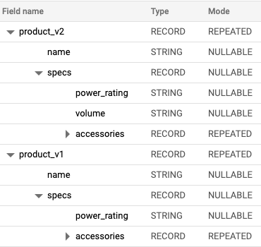

[![early-release]][tracker-classificiation] [![License][license-image]][license] [![Discourse posts][discourse-image]][discourse]


# snowplow-utils

This package contains a mix of functionality to be used with the other Snowplow dbt packages, or to be used within your own packages/projects.

Includes:

- Overwritten incremental materialization.
- Utils to assist with modeling Snowplow data.
- Pre and post hooks to handle incremental processing of events.
- Various helper macros used throughout data modeling.

## Contents

**[Macros](#macros)**

- [snowplow-utils](#snowplow-utils)
  - [Contents](#contents)
  - [Macros](#macros)
    - [get\_columns\_in\_relation\_by\_column\_prefix (source)](#get_columns_in_relation_by_column_prefix-source)
    - [combine\_column\_versions (source)](#combine_column_versions-source)
    - [is\_run\_with\_new\_events (source)](#is_run_with_new_events-source)
    - [snowplow\_web\_delete\_from\_manifest (source)](#snowplow_web_delete_from_manifest-source)
    - [snowplow\_mobile\_delete\_from\_manifest (source)](#snowplow_mobile_delete_from_manifest-source)
    - [get\_value\_by\_target (source)](#get_value_by_target-source)
    - [set\_query\_tag (source)](#set_query_tag-source)
    - [get\_sde\_or\_context (source)](#get_sde_or_context-source)
    - [get\_field (source)](#get_field-source)
    - [Array functions](#array-functions)
      - [get\_array\_to\_string (source)](#get_array_to_string-source)
      - [get\_split\_to\_array (source)](#get_split_to_array-source)
      - [get\_string\_agg (source)](#get_string_agg-source)
      - [get\_array\size (source)](#get_array_size-source)
      - [unnest (source)](#unnest-source)
    - [Date & time functions](#date-&-time-functions)
      - [timestamp\_diff (source)](#timestamp_diff-source)
      - [timestamp\_add (source)](#timestamp_add-source)
      - [cast\_to\_tstamp (source)](#cast_to_tstamp-source)
      - [to\_unixtstamp (source)](#to_unixtstamp-source)
      - [current\_timestamp\_in\_utc (source)](#current_timestamp_in_utc-source)
      - [n\_timedeltas\_ago (source)](#n_timedeltas_ago-source)
  - [Materializations](#materializations)
    - [Optimized incremental](#optimized-incremental)
    - [BigQuery](#bigquery)
    - [Snowflake](#snowflake)
    - [Notes](#notes)
  - [Base Macro](#base-macro)
    - [Create Snowplow Quarantined Sessions (source)](#create-snowplow-quarantined-sessions-source)
    - [Create Snowplow Incremental Manifest (source)](#create-snowplow-incremental-manifest-source)
    - [Create Snowplow Sessions Lifecycle Manifest (source)](#create-snowplow-sessions-lifecycle-manifest-source)
    - [Create Snowplow Sessions This Run (source)](#create-snowplow-sessions-this-run-source)
    - [Create Snowplow Events This Run (source)](#create-snowplow-events-this-run-source)
- [Join the Snowplow community](#join-the-snowplow-community)
- [Copyright and license](#copyright-and-license)


## Macros

There are many macros contained in this package, with the majority designed for use internally at Snowplow.

There are however a selection that were intended for public use and that can assist you in modelling Snowplow data. The documentation for these macros can be found below.

### get_columns_in_relation_by_column_prefix ([source](macros/utils/get_columns_in_relation_by_column_prefix.sql))

This macro returns an array of column objects within a relation that start with the given column prefix. This is useful when you have multiple versions of a column within a table and want to dynamically identify all versions.

**Arguments:**

- `relation`: The relation from which to search for matching columns.
- `column_prefix`: The column prefix to search for.

**Returns:**

- An array of [column objects][dbt-column-objects]. The name of each column can be accessed with the name property.

**Usage:**

```sql



  {{ column.name }}


# Renders to something like:
'custom_context_1_0_1'
'custom_context_1_0_2'
'custom_context_1_0_3'
```

The order of the matched columns is denoted by their ordinal position.

### combine_column_versions ([source](macros/utils/bigquery/combine_column_versions.sql))

*BigQuery Only.* This macro is designed primarily for combining versions of custom context or an unstructured event column from the Snowplow events table in BigQuery.

As your schemas for such columns evolve, multiple versions of the same column will be created in your events table e.g. `custom_context_1_0_0`, `custom_context_1_0_1`. These columns contain nested fields i.e. are of a datatype `RECORD`. When modeling Snowplow data it can be useful to combine or coalesce each nested field across all versions of the column for a continuous view over time. This macro mitigates the need to update your coalesce statement each time a new version of the column is created.

Fields can be selected using 4 methods:

- Select all fields. Default.
- Select by field name using the `required_fields` arg.
- Select all fields at a given level/depth of nesting e.g. all 1st level fields. Uses the `nested_level` arg.
- Select all fields, excluding specific versions using the `exclude_versions` arg.

By default any returned fields will be assigned an alias matching the field name e.g. `coalesce(<col_v2>.product, <col_v1>.product) as product`. For heavily nested fields, the alias will be field's path with `.` replaced with `_` e.g. for a field `product.size.height` will have an alias `product_size_height`. A custom alias can be supplied with the `required_fields` arg (see below).

**Arguments:**

- `relation`: The relation from which to search for matching columns.
- `column_prefix`: The column prefix to search for.
- `required_fields`: Optional. List of fields to return. For fields nested deeper than the 1st level specify the path using dot notation e.g. `product.name`. To use a custom field alias, pass a tuple containing the field name and alias e.g. `(<field_name>, <field_alias>)`.
- `nested_level`: Optional. The level from which to return fields e.g. `1` to return all 1st level fields. Behaviour can be changed to comparison using `level_filter` arg.
- `level_filter`: Default `equalto`. Accepted values `equalto`, `lessthan`, `greaterthan`. Used in conjunction with `nested_level` to determine which fields to return.
- `relation_alias`: Optional. The alias of the relation containing the column. If passed the alias will be prepended to the full path for each field e.g. `<relation_alias>.<column>.<field>`. Useful when your desired column occurs in multiple relations within your model.
- `include_field_alias`: Default `True`. Determines whether to included the field alias in the final coalesced field e.g. `coalesce(...) as <field_alias>`. Useful when using the field as part of a join.
- `array_index`: Default 0. If the column is of mode `REPEATED` i.e. an array, this determines the element to take. All Snowplow context columns are arrays, typically with only a single element.
- `max_nested_level`: Default 15. Imposes a hard stop for recursions on heavily nested data.
- `exclude_versions`: Optional. List of versions to be excluded from column coalescing. Versions should be provided as an array of strings in snake case (`['1_0_0']`)

**Returns:**

- An array, with each item being a string of coalesced paths to a field across each version of the column. The order of the coalesce is determined by the version of the column, with the latest taking precedent.

**Usage:**

The following examples assumes two 'product' context columns with the following schemas:



**All fields**

```sql


select

  {{field}} ,


# Renders to:
select
  coalesce(product_v2[safe_offset(0)].name, product_v1[safe_offset(0)].name) as name,
  coalesce(product_v2[safe_offset(0)].specs, product_v1[safe_offset(0)].specs) as specs,
  coalesce(product_v2[safe_offset(0)].specs.power_rating, product_v1[safe_offset(0)].specs.power_rating) as specs_power_rating,
  coalesce(product_v2[safe_offset(0)].specs.volume) as specs_volume,
  coalesce(product_v2[safe_offset(0)].specs.accessories, product_v1[safe_offset(0)].specs.accessories) as specs_accessories
```

Note fields within `accessories` are not unnested as `accessories` is of mode `REPEATED`. See limitations section below.

**Fields filtered by name**

```sql


select

  {{field}} ,


# Renders to:
select
  coalesce(product_v2[safe_offset(0)].name, product_v1[safe_offset(0)].name) as name,
  coalesce(product_v2[safe_offset(0)].specs.power_rating, product_v1[safe_offset(0)].specs.power_rating) as product_power_rating
```

Note we have renamed the power rating field by passing a tuple of the field name and desired field alias.

**Fields filtered by level**

```sql


select

  {{field}} ,


# Renders to:
select
  coalesce(product_v2[safe_offset(0)].name, product_v1[safe_offset(0)].name) as name,
  coalesce(product_v2[safe_offset(0)].specs, product_v1[safe_offset(0)].specs) as specs
```

**Limitations**

- If a field is of the data type `RECORD` and a mode `REPEATED`, i.e. an array of structs, it's sub/nested fields will not be unnested.

### is_run_with_new_events ([source](macros/utils/is_run_with_new_events.sql))

This macro is designed for use with Snowplow data modelling packages like `snowplow-web`. It can be used in any incremental models, to effectively block the incremental model from being updated with old data which it has already consumed. This saves cost as well as preventing historical data from being overwritten with partially complete data (due to a batch back-fill for instance).

The macro utilizes the `snowplow_[platform]_incremental_manifest` table to determine whether the model from which the macro is called, i.e. `{{ this }}`, has already consumed the data in the given run. If it has, it returns `false`. If the data in the run contains new data, `true` is returned.

**Arguments:**

- `package_name`: The modeling package name i.e. `snowplow-mobile`.

**Returns:**

- Boolean. `true` if the run contains new events previously not consumed by `this`, `false` otherwise.

**Usage:**

```sql
{{
  config(
    materialized='incremental',
    unique_key='screen_view_id',
    upsert_date_key='start_tstamp'
  )
}}

select
  ...

from {{ ref('snowplow_mobile_base_events_this_run' ) }}
where {{ snowplow_utils.is_run_with_new_events('snowplow_mobile') }} --returns false if run doesn't contain new events.
```

### snowplow_web_delete_from_manifest ([source](macros/utils/snowplow_delete_from_manifest.sql))

The `snowplow-web` package makes use of a centralised manifest system to record the current state of the package. There may be times when you want to remove the metadata associated with particular models from the manifest, for instance to replay events through a particular model.

This can be performed as part of the run-start operation of the snowplow-web package, as described in the [docs][snowplow-web-docs]. You can however perform this operation independently using the `snowplow_web_delete_from_manifest` macro.

**Arguments:**

- `models`: Either an array of models to delete, or a string for a single model.

**Usage:**

```bash
dbt run-operation snowplow_web_delete_from_manifest --args "models: ['snowplow_web_page_views','snowplow_web_sessions']"
# or
dbt run-operation snowplow_web_delete_from_manifest --args "models: snowplow_web_page_views"
```

### snowplow_mobile_delete_from_manifest ([source](macros/utils/snowplow_delete_from_manifest.sql))

The `snowplow-mobile` package makes use of a centralised manifest system to record the current state of the package. There may be times when you want to remove the metadata associated with particular models from the manifest, for instance to replay events through a particular model.

This can be performed as part of the run-start operation of the snowplow-mobile package, as described in the [docs][snowplow-mobile-docs]. You can however perform this operation independently using the `snowplow_mobile_delete_from_manifest` macro.

**Arguments:**

- `models`: Either an array of models to delete, or a string for a single model.

**Usage:**

```bash
dbt run-operation snowplow_mobile_delete_from_manifest --args "models: ['snowplow_mobile_screen_views','snowplow_mobile_sessions']"
# or
dbt run-operation snowplow_mobile_delete_from_manifest --args "models: snowplow_mobile_screen_views"
```

### get_value_by_target ([source](macros/utils/get_value_by_target.sql))

This macro is designed to dynamically return values based on the target (`target.name`) you are running against. Your target names are defined in your [profiles.yml](https://docs.getdbt.com/reference/profiles.yml) file. This can be useful for dynamically changing variables within your project, depending on whether you are running in dev or prod.

**Arguments:**

- `dev_value`: The value to be returned if running against your dev target, as defined by `dev_target_name`.
- `default_value`: The default value to return, if not running against your dev target.
- `dev_target_name`: Default: `dev`. The name of your dev target as defined in your `profiles.yml` file.

**Usage:**

```yml
# dbt_project.yml
...
vars:
  snowplow_web:
    snowplow__backfill_limit_days: "{{ snowplow_utils.get_value_by_target(dev_value=1, default_value=30, dev_target_name='dev') }}"
```

**Returns:**

- `dev_value` if running against your dev target, otherwise `default_value`.

### set_query_tag ([source](macros/utils/set_query_tag.sql))

This macro takes a provided statement as argument and generates the SQL command to set this statement as the query_tag for Snowflake databases, and does nothing otherwise. It can be used to safely set the query_tag regardless of database type.

**Arguments:**

- `statement`: The query_tag that you want to set in your Snowflake session.


**Usage:**

```sql
{{ snowplow_utils.set_query_tag('snowplow_query_tag') }}
```

**Returns:**

- The SQL statement which will update the query tag in Snowflake, or nothing in other databases.


### get_sde_or_context ([source](macros/utils/get_sde_or_context.sql))

This macro exists for Redshift and Postgres users to more easily select their self-describing event and context tables and apply de-duplication before joining onto their (already de-duplicated) events table. The `root_id` and `root_tstamp` columns are by default returned as `schema_name_id` and `schema_name_tstamp` respectively, where `schema_name` is the value in the `schema_name` column of the table. In the case where multiple entities may be sent in the context (e.g. products in a search results), you should set the `single_entity` argument to `false` and use an additional criteria in your join (see [the snowplow docs](https://docs.snowplow.io/docs/modeling-your-data/modeling-your-data-with-dbt/dbt-advanced-usage/dbt-duplicates/) for further details).

Note that it is the responsibility of the user to ensure they have no duplicate names when using this macro multiple times or when a schema column name matches a column already in the events table. In this case the `prefix` argument should be used and aliasing applied to the output.

**Usage:**

With at most one entity per context:
```sql
with {{ snowplow_utils.get_sde_or_context('atomic', 'nl_basjes_yauaa_context_1', "'2023-01-01'", "'2023-02-01'")}}

select
...
from my_events_table a
left join nl_basjes_yauaa_context_1 b on
    a.event_id = b.yauaa_context__id
    and a.collector_tstamp = b.yauaa_context__tstamp
```
With the possibility of multiple entities per context, your events table must already be de-duped but still have a field with the number of duplicates:
```sql
with {{ snowplow_utils.get_sde_or_context('atomic', 'nl_basjes_yauaa_context_1', "'2023-01-01'", "'2023-02-01'", single_entity = false)}}

select
...,
count(*) over (partition by a.event_id) as duplicate_count
from my_events_table a
left join nl_basjes_yauaa_context_1 b on
    a.event_id = b.yauaa_context__id
    and a.collector_tstamp = b.yauaa_context__tstamp
    and mod(b.yauaa_context__index, a.duplicate_count) = 0
```

**Returns:**

CTE sql for deduplicated records from the schema table, without the schema details columns. The final CTE is the name of the original table. e.g.

```sql
dd_my_context_table as (
  select ..., ... as dedupe_index from my_schema.my_context_table
),

my_context_table as (
  select ... from dd_my_context_table where dedupe_index = 1
)
```

With at most one entity per context:
```sql
dd_my_context_table as (
  select ..., ... as dedupe_index from my_schema.my_context_table
),

my_context_table as (
  select ..., root_id as my_context_table__id, root_tstamp as my_context_table__tstamp from dd_my_context_table where dedupe_index = 1
)
```
With the possibility of multiple entities per context, your events table must already be de-duped but still have a field with the number of duplicates:
```sql
dd_my_context_table as (
  select ..., ... as dedupe_index from my_schema.my_context_table
),

my_context_table as (
  select ..., , root_id as my_context_table__id, root_tstamp as my_context_table__tstamp, ... as my_context_table__index from dd_my_context_table
)
```

### get_field ([source](macros/utils/cross_db/get_field.sql))

This macro exists to make it easier to extract a field from our `unstruct_` and `contexts_` type columns for users in Snowflake, Databricks, and BigQuery (using a wildcard version number is only possible for BigQuery e.g. `column_name = 'contexts_nl_basjes_yauaa_context_1_*'`). The macro can handle type casting and selecting from arrays.

**Returns:**

sql line to select the field specified from the column

**Usage:**


Extracting a single field
```sql

select
{{ snowplow_utils.get_field(column_name = 'contexts_nl_basjes_yauaa_context_1',
                            field_name = 'agent_class',
                            table_alias = 'a',
                            type = 'string',
                            array_index = 0)}} as yauaa_agent_class
from
    my_events_table a

```

Extracting multiple fields
```sql

select

  {{ snowplow_utils.get_field(column_name = 'contexts_nl_basjes_yauaa_context_1',
                            field_name = field[0],
                            table_alias = 'a',
                            type = field[1],
                            array_index = 0)}} as {{ field[0] }}


from
    my_events_table a

``````

### Array functions


#### get_array_to_string ([source](macros/utils/cross_db/get_array_to_string.sql))

This macro takes care of harmonizing cross-db functions that flatten an array to a string. It takes an array column, a column prefix and a delimiter as an argument.


**Usage:**

```sql
{{ snowplow_utils.get_array_to_string('array_column', 'column_prefix', 'delimiter') }}
```

**Returns:**

 - The database equivalent of a string datatype with the maximum allowed length
#### get_split_to_array ([source](macros/utils/cross_db/get_split_to_array.sql))

This macro takes care of harmonizing cross-db functions that create an array out of a string. It takes a string column, a column prefix and a delimiter as an argument.


**Usage:**

```sql
{{ snowplow_utils.get_split_to_array('string_column', 'column_prefix', 'delimiter') }}
```

**Returns:**

- An array field.

#### get_string_agg ([source](macros/utils/cross_db/get_string_agg.sql))

This macro takes care of harmonizing cross-db `list_agg`, `string_agg` type functions. These are aggregate functions that take all expressions from rows and concatenate them into a single string.

A base column and its prefix have to be provided, the separator is optional (default is ',').

By default ordering is defined by sorting the base column in ascending order. If you wish to order on a different column, the `order_by_column` and `order_by_column_prefix` have to be provided. If you wish to order in descending order, then set `order_desc` to `true`.

In case the field used for sorting happens to be of numeric value (regardless of whether it is stored as a string or as a numeric type) the `sort_numeric` parameter should be set to true, which takes care of conversions from sting to numeric if needed.

There is also an optional boolean parameter called `is_distinct` which, when enabled, takes care of deduping individual elements within the array.

**Usage:**

```sql
{{ snowplow_utils.get_string_agg('base_column', 'column_prefix', ';', 'order_by_col', sort_numeric=true, order_by_column_prefix='order_by_column_prefix', is_distict=True, order_desc=True) }}

```

**Returns:**

- The database equivalent of a string datatype with the maximum allowed length

#### get_array_size ([source](macros/utils/cross_db/get_array_size.sql))

This macro takes care of harmonizing cross-db `get_array` type functions. It returns the number of elements in an array.

**Usage:**

```sql
{{ snowplow_utils.get_array_size('array_column') }}

```

**Returns:**

- The the number of elements in an array.

#### unnest ([source](macros/utils/cross_db/unnest.sql))

This macro takes care of unnesting of arrays regardles of the data warehouse. An id column and the colum to base the unnesting off of needs to be specified as well as a field alias and the source table. Optionally you can extract the indexed element number (starting from 0) to maintain the original order by setting the 'with_index' variable to true.


**Usage:**

```sql
{{ snowplow_utils.unnest('id_column', 'array_to_be_unnested', 'field_alias', 'source_table', with_index= false) }}
```

**Returns:**

- The database equivalent of a string datatype with the maximum allowed length. Optionally retruns the index column.


### Date & time functions
#### timestamp_diff ([source](macros/utils/cross_db/timestamp_functions.sql))

This macro mimics the utility of the dbt_utils version however for BigQuery it ensures that the timestamp difference is calculated, similar to the other DB engines which is not the case in the dbt_utils macro. This macro calculates the difference between two dates. Note: The datepart argument is database-specific.

**Arguments:**

- `first_stamp`: The earlier timestamp to subtract by
- `second_tstamp`: The later timestamp to subtract from
- `datepart`: The unit of time that the result is denoted it

**Usage:**

```sql
{{ snowplow_utils.timestamp_diff('2022-01-10 10:23:02', '2022-01-14 09:40:56', 'day') }}
```

**Returns:**

- The timestamp difference between two fields denoted in the requested unit

#### timestamp_add ([source](macros/utils/cross_db/timestamp_functions.sql))

This macro mimics the utility of the dbt_utils version however for BigQuery it ensures that the timestamp difference is calculated, similar to the other DB engines which is not the case in the dbt_utils macro. This macro adds a date/time interval to the supplied date/timestamp. Note: The datepart argument is database-specific.


**Arguments:**

- `datepart`: The date/time type of interval to be added
- `interval`: The amount of time of the datepart to be added
- `tstamp`: The timestamp to add the interval to

**Usage:**

```sql
{{ snowplow_utils.timestamp_add('day', 5, '2022-02-01 10:05:32') }}
```

**Returns:**

- The new timestamp that results in adding the interval to the provided timestamp.

#### cast_to_tstamp ([source](macros/utils/cross_db/timestamp_functions.sql))

This macro casts a column to a timestamp across databases. It is an adaptation of the `type_timestamp()` macro from dbt-core.

**Arguments:**

- `tstamp_literal`: The column that is to be cast to a tstamp data type

**Usage:**

```sql
{{ snowplow_utils.cast_to_tstamp('events.collector_tstamp') }}
```

**Returns:**

- The field as a timestamp

#### to_unixtstamp ([source](macros/utils/cross_db/timestamp_functions.sql))

This macro casts a column to a unix timestamp across databases.

**Arguments:**

- `tstamp`: The column that is to be cast to a unix timestamp

**Usage:**

```sql
{{ snowplow_utils.to_unixtstamp('events.collector_tstamp') }}
```

**Returns:**

- The field as a unix timestamp

#### current_timestamp_in_utc ([source](macros/utils/cross_db/timestamp_functions.sql))

This macro returns the current timestamp in UTC.

**Usage:**

```sql
{{ snowplow_utils.current_timestamp_in_utc() }}
```

**Returns:**
The current timestamp in UTC.

### n_timedeltas_ago ([source](macros/utils/n_timedeltas_ago.sql))

This macro takes the current timestamp and subtracts `n` units, as defined by the `timedelta_attribute`, from it. This is achieved using the Python datetime module, rather than querying your database.

**Arguments:**

- `n`: The number of timedeltas to subtract from the current timestamp.
- `timedelta_attribute`: The type of units to subtract. This can be any valid attribute of the [timedelta](https://docs.python.org/3/library/datetime.html#timedelta-objects) object.

**Usage:**

```sql
{{ snowplow_utils.n_timedeltas_ago(1, 'weeks') }}
```

**Returns:**

- Current timestamp minus `n` units.

By combining this with the `get_value_by_target` macro, you can dynamically set dates depending on your environment:

```yml
# dbt_project.yml
...
vars:
  snowplow_mobile:
    snowplow__start_date: "{{ snowplow_utils.get_value_by_target(
                                      dev_value=snowplow_utils.n_timedeltas_ago(1, 'weeks'),
                                      default_value='2020-01-01',
                                      dev_target_name='dev') }}"
```
## Materializations

### Optimized incremental

This package provides an enhanced version of the standard incremental materialization. This builds upon the out-of-the-box incremental materialization provided by dbt, by limiting the length of the table scans on the destination table. This improves both performance and reduces cost. The following methodology is used to calculate the limit of the table scan:

- The minimum date is found in the `tmp_relation`, based on the `upsert_date_key`
- By default, 30 days are subtracted from this date. This is set by `snowplow__upsert_lookback_days`. We found when modeling Snowplow data, having this look-back period of 30 days can help minimise the chance of introducing duplicates in your destination table. Reducing the number of look-back days will improve performance further but increase the risk of duplicates.
- The look-back can be disabled altogether, by setting `disable_upsert_lookback=true` in your model's config (see below). This is not recommended for most use cases.

To enable this optimized version you must add `snowplow_optimize=true` to the config of any model using it, and add the following once to your `dbt_project.yml` file:

```yml
dispatch:
  - macro_namespace: dbt
    search_order: ['snowplow_utils', 'dbt']
```

This optimization adds an additional `predicate`, based on the logic above, to the per-warehouse sql generated by dbt, and we use the [default incremental strategy](https://docs.getdbt.com/docs/build/incremental-models#about-incremental_strategy) for each warehouse.

Because we only overwrite the `get_merge_sql`/`get_delete_insert_merge_sql` this means all options and features of the standard incremental materialization are available, including `on_schema_change` and `incremental_predicates`.

Each config must contain, in addition to `snowplow_optimize`, an `upsert_date_key` and a `unique_key`. We support Snowflake, BigQuery, Redshift, Postgres, Spark, and Databricks, however some warehouses have some additional config options that we recommend using to get the most out of the optimization.

### BigQuery

For BigQuery it is advised (and required for the optimization to work) to add a `partition_by` to the config.

**Usage:**

```sql
{{
  config(
    materialized='incremental',
    unique_key='page_view_id', # Required: the primary key of your model
    upsert_date_key='start_tstamp', # Required: The date key to be used to calculate the limits
    partition_by = snowplow_utils.get_value_by_target_type(bigquery_val={
      "field": "start_tstamp",
      "data_type": "timestamp",
      "granularity": "day" # Only introduced in dbt v0.19.0+. Defaults to 'day' for dbt v0.18 or earlier
    }) # Adds partitions to destination table.
  )
}}
```

### Snowflake

During testing we found that providing the `upsert_date_key` as a cluster key results in more effective partition pruning. This does add overhead however as the dataset needs to be sorted before being upserted. In our testing this was a worthwhile trade off, reducing overall costs. Your mileage may vary, as variables like row count can affect this.

**Usage:**

```sql
{{
  config(
    materialized='incremental',
    unique_key='page_view_id', # Required: the primary key of your model
    upsert_date_key='start_tstamp', # Required: The date key to be used to calculate the limits
    cluster_by='to_date(start_tstamp)' # Optional.
  )
}}
```

### Notes

- `snowplow__upsert_lookback_days` defaults to 30 days. If you set `snowplow__upsert_lookback_days` to too short a period, duplicates can occur in your incremental table.

## Base Macro

### Create Snowplow Quarantined Sessions ([source](macros/base/base_create_snowplow_quarantined_sessions.sql))

This macro generates a table which contains a column named `session_identifier`, containing all session identifiers of sessions that have been quarantined due to exceeding the maximum session length, to avoid long table scans.


**Usage:**

```sql


{{ quarantined_query }}
```

**Returns:**

- A SQL query to generate the quarantined sessions table

### Create Snowplow Incremental Manifest ([source](macros/base/base_create_snowplow_incremental_manifest.sql))

This macro generates the incremental manifest table that Snowplow leverages, and does not require any arguments.


**Usage:**

```sql


{{ incremental_manifest_query }}
```

**Returns:**

- A SQL query to generate the incremental manifest table

### Create Snowplow Sessions Lifecycle Manifest ([source](macros/base/base_create_snowplow_sessions_lifecycle_manifest.sql))

This macro generates the sessions lifecycle manifest table that Snowplow leverages.

**Arguments:**

- `session_identifiers`: An array of key:value maps of session identifiers that have at least the following properties: `schema`, `field`.
- `session_sql`: A SQL statement that will be used to create the `session_identifier`.
- `session_timestamp`: The timestamp to be used to set the start and end of the session.
- `user_identifiers`: An array of key:value maps of user identifiers that have at least the following properties: `schema`, `field`.
- `user_sql`: A SQL statement that will be used to create the `user_identifier`.
- `quarantined_sessions`: The name of the table containing all quarantined sessions.
- `derived_tstamp_partitioned`: Whether or not the events table is partitioned on derived timestamps (BQ only), used for optimization.
- `days_late_allowed`: The maximum allowed number of days between the event creation and it being sent to the collector.
- `max_session_days`: The maximum allowed session length in days.
- `app_ids`: A list of app_ids to filter the events table on for processing within the package.
- `snowplow_events_database`: The name of your database where your events land.
- `snowplow_events_schema`: The schema (dataset for BigQuery) that contains your atomic events table.
- `snowplow_events_table`: The name of your events table where your events land.
- `event_limits_table`: The name of the table where your Snowplow event limits are stored.
- `incremental_manifest_table`: The name of the incremental manifest table.
- `package_name`: The name of the package you are running this macro under.
- `allow_null_dvce_tstamps`: A boolean to allow nulls for the dvce_created_tstamp or dvce_sent_tstamp fields for certain tracker users when it is safe to bypass the events sent late check/filter using days_late_allowed

**Usage:**

```sql
{% set sessions_lifecycle_manifest_query = snowplow_utils.base_create_snowplow_sessions_lifecycle_manifest(
    var('snowplow__session_identifiers', '[{"schema": "atomic", "field": "domain_sessionid"}]'),
    var('snowplow__session_timestamp', 'collector_tstamp'),
    var('snowplow__user_identifiers', '[{"schema": "atomic", "field": "domain_userid"}]'),
    var('snowplow__quarantined_sessions', 'snowplow_base_quarantined_sessions'),
    var('snowplow__derived_tstamp_partitioned', true),
    var('snowplow__days_late_allowed', 3),
    var('snowplow__max_session_days', 3),
    var('snowplow__app_ids', []),
    var('snowplow__events_schema', 'atomic'),
    var('snowplow__events_table', 'events'),
    var('snowplow__event_limits', 'snowplow_base_new_event_limits'),
    var('snowplow__incremental_manifest', 'snowplow_incremental_manifest'),
    var('snowplow__package_name, 'snowplow')
 ) %}

{{ sessions_lifecycle_manifest_query }}
```

**Returns:**

- A SQL query to generate the sessions lifecycle manifest table

### Create Snowplow Sessions This Run ([source](macros/base/base_create_snowplow_sessions_this_run.sql))

This macro generates the sessions this run table that Snowplow leverages.

**Arguments:**

- `lifecycle_manifest_table`: The name of the sessions lifecycle manifest table.
- `new_event_limits_table`: The name of the table where your Snowplow event limits are stored.

**Usage:**

```sql


{{ sessions_query }}
```

**Returns:**

- A SQL query to generate the sessions this run table

### Create Snowplow Events This Run ([source](macros/base/base_create_snowplow_events_this_run.sql))

This macro generates the events this run table that Snowplow leverages.

**Arguments:**

- `sessions_this_run_table`: The name of your sessions this run table.
- `session_identifiers`: An array of key:value maps of session identifiers that have at least the following properties: `schema`, `field`.
- `session_sql`: A SQL statement that will be used to create the `session_identifier`.
- `session_timestamp`: The timestamp to be used to set the start and end of the session.
- `derived_tstamp_partitioned`: Whether or not to partition on derived timestamps (BQ only).
- `days_late_allowed`: The maximum allowed number of days between the event creation and it being sent to the collector.
- `max_session_days`: The maximum allowed session length in days.
- `app_ids`: A list of app_ids to filter the events table on for processing within the package.
- `snowplow_events_database`: The name of your database where your events land.
- `snowplow_events_schema`: The schema (dataset for BigQuery) that contains your atomic events table.
- `snowplow_events_table`: The name of your events table where your events land.
- `entities_or_sdes`: In Redshift & Postgres, due to the shredded table design (meaning each context is loaded separately into a table), you need to specify which contexts you want to be included in the snowplow_base_events_this_run table, which you can do using this variable. This needs to be an array of key:value maps with the following properties: `name`, `prefix`, `alias`, `single_entity`
- `custom_sql`: Any custom SQL you want to include within your `events_this_run` table
- `allow_null_dvce_tstamps`: A boolean to allow nulls for the dvce_created_tstamp or dvce_sent_tstamp fields for certain tracker users when it is safe to bypass the events sent late check/filter using days_late_allowed

**Usage:**

```sql
{% set base_events_query = snowplow_utils.base_create_snowplow_events_this_run(
    var('snowplow__base_sessions', 'snowplow_base_sessions_this_run'),
    var('snowplow__session_identifiers', '[{"schema": "atomic", "field": "domain_sessionid"}]'),
    var('snowplow__session_timestamp', 'collector_tstamp'),
    var('snowplow__derived_tstamp_partitioned', true),
    var('snowplow__days_late_allowed', 3),
    var('snowplow__max_session_days', 3),
    var('snowplow__app_ids', []),
    var('snowplow__events_schema', 'atomic'),
    var('snowplow__events_table', 'events')) %}

{{ base_events_query }}
```

**Returns:**

- A SQL query to generate the events this run table

# Join the Snowplow community

We welcome all ideas, questions and contributions!

For support requests, please use our community support [Discourse][discourse] forum.

If you find a bug, please report an issue on GitHub.

# Copyright and license

The snowplow-utils package is Copyright 2021-present Snowplow Analytics Ltd.

This distribution is all licensed under the [Snowplow Personal and Academic License][license] . (If you are uncertain how it applies to your use case, check our answers to [frequently asked questions](https://docs.snowplow.io/docs/contributing/community-license-faq/).)

[license]: https://docs.snowplow.io/personal-and-academic-license-1.0/
[license-image]: http://img.shields.io/badge/license-Snowplow--Personal--and--Academic--1-blue.svg?style=flat
[tracker-classificiation]: https://docs.snowplowanalytics.com/docs/collecting-data/collecting-from-own-applications/tracker-maintenance-classification/
[early-release]: https://img.shields.io/static/v1?style=flat&label=Snowplow&message=Early%20Release&color=014477&labelColor=9ba0aa&logo=data:image/png;base64,iVBORw0KGgoAAAANSUhEUgAAABAAAAAQCAMAAAAoLQ9TAAAAeFBMVEVMaXGXANeYANeXANZbAJmXANeUANSQAM+XANeMAMpaAJhZAJeZANiXANaXANaOAM2WANVnAKWXANZ9ALtmAKVaAJmXANZaAJlXAJZdAJxaAJlZAJdbAJlbAJmQAM+UANKZANhhAJ+EAL+BAL9oAKZnAKVjAKF1ALNBd8J1AAAAKHRSTlMAa1hWXyteBTQJIEwRgUh2JjJon21wcBgNfmc+JlOBQjwezWF2l5dXzkW3/wAAAHpJREFUeNokhQOCA1EAxTL85hi7dXv/E5YPCYBq5DeN4pcqV1XbtW/xTVMIMAZE0cBHEaZhBmIQwCFofeprPUHqjmD/+7peztd62dWQRkvrQayXkn01f/gWp2CrxfjY7rcZ5V7DEMDQgmEozFpZqLUYDsNwOqbnMLwPAJEwCopZxKttAAAAAElFTkSuQmCC

[discourse-image]: https://img.shields.io/discourse/posts?server=https%3A%2F%2Fdiscourse.snowplowanalytics.com%2F
[discourse]: http://discourse.snowplowanalytics.com/
[snowplow-web]: https://github.com/snowplow/dbt-snowplow-web
[snowplow-mobile]: https://github.com/snowplow/dbt-snowplow-mobile
[snowplow-web-docs]: https://snowplow.github.io/dbt-snowplow-web/#!/overview/snowplow_web
[snowplow-mobile-docs]: https://snowplow.github.io/dbt-snowplow-mobile/#!/overview/snowplow_mobile
[dbt-snowflake-merge-strategy]: https://docs.getdbt.com/reference/resource-configs/snowflake-configs#merge-behavior-incremental-models
[snowflake-merge-duplicates]: https://docs.snowflake.com/en/sql-reference/sql/merge.html#duplicate-join-behavior
[dbt-column-objects]: https://docs.getdbt.com/reference/dbt-classes#column
